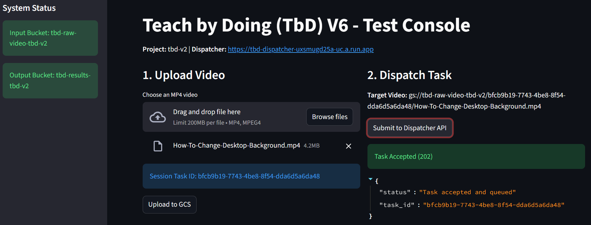
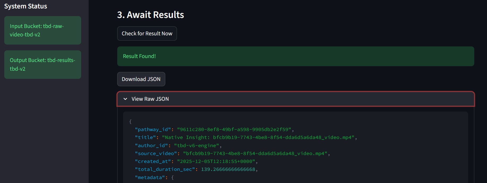

# Teach-by-Doing (TbD) V6 – Pathways-as-Data Engine

Teach-by-Doing (TbD) V6 is the ingestion and understanding engine for the **Pathways-as-Data (PAD)** ecosystem.  
It converts expert task videos into machine-readable **Pathways** – structured JSON artifacts that can drive human
documentation, LLM agents, and (eventually) robotics and automation workflows.

- **Author:** Greg Burns  
- **Role:** Systems Architect · ML Engineer · Product Co-Designer  
- **Core Stack:** Python · OpenCV · Optical Flow / SSIM · LLMs (Gemini / GPT) · LSTM-style Temporal Encoder · FastAPI · Streamlit

---

## 1. High-Level Architecture

At a high level, TbD V6 implements the following flow:

1. **Ingestion**  
   A client uploads a task video (screen recording or camera capture) and receives a trace ID.

2. **Dispatch & Orchestration**  
   A dispatcher service assigns work to a background worker using Pub/Sub-style messaging and idempotent state tracking.

3. **Processing Pipeline**  
   The worker:
   - Segments video into candidate steps (SSIM / optical flow + heuristics)
   - Runs OCR / visual analysis
   - Calls an LLM to generate semantic step descriptions
   - Calls a separate temporal encoder service (LSTM) to derive context vectors over the sequence
   - Optionally calls an object detector to improve UI-region grounding

4. **Pathway Export (PAD)**  
   The system writes a `Pathway.json` file containing:
   - Nodes (steps) with descriptions, timestamps, metadata
   - Edges/transitions between steps
   - Temporal embeddings / context vectors
   - Additional metadata for downstream consumers

5. **Frontend & UX**  
   A Streamlit frontend lets users:
   - Upload videos
   - Trigger processing
   - Inspect the generated pathway visually
   - Download the `Pathway.json` artifact

### Architecture Diagram

The core architecture is captured in the following diagram:



This diagram illustrates:

- Client → Dispatcher (API gateway) → Worker orchestration  
- Vision / OCR / LLM / Temporal Encoder / Object Detector services  
- Output and registration of `Pathway.json` artifacts  

---

## 2. Repository Structure

This repository is organized to reflect the core TbD V6 services and supporting assets:

```text
tbd/
├── app/                     # Core backend services (dispatcher, worker, pipeline)
│   ├── main.py              # FastAPI app entrypoint (dispatcher / worker API)
│   ├── schema.py            # Pathways-as-Data (PAD) Pydantic models
│   └── services/            # Service layer components
│       ├── dispatcher.py    # Request ingestion, trace handling
│       ├── genai.py         # LLM integration for semantic descriptions
│       ├── ocr.py           # OCR / text extraction helpers
│       ├── pipeline.py      # Orchestration of the processing pipeline
│       ├── segment.py       # SSIM / optical flow segmentation utilities
│       ├── vision.py        # Computer vision helpers
│       └── worker.py        # Worker implementation for long-running tasks
│
├── frontend/                # Streamlit demo UI
│   ├── frontend.py          # Main Streamlit app
│   └── requirements.txt     # Frontend-only dependencies
│
├── tbd-detector/            # Object detection microservice (Service D)
│   ├── detector_app/
│   │   └── main.py          # Detector service entrypoint
│   ├── build_yolo_model.py  # Model build / conversion script
│   ├── yolov8n.pt           # YOLOv8 model weights (PyTorch)
│   ├── yolov8n.onnx         # YOLOv8 ONNX export
│   ├── model_yolo.h5        # Converted YOLO model
│   ├── model_yolo.zip       # Archived model
│   ├── calibration_image_sample_data_*.npy  # Calibration / sample data
│   ├── detector_requirements.txt
│   └── Dockerfile           # Container build for the detector
│
├── tbd-encoder/             # Temporal encoder microservice (Service C)
│   ├── encoder_app/
│   │   └── main.py          # Encoder service entrypoint (LSTM-style)
│   ├── lstm_model.h5        # Pretrained LSTM temporal model
│   ├── tokenizer.pickle.bak # Tokenizer / vocabulary data
│   ├── create_tokenizer.py  # Tokenizer creation script
│   ├── create_compatible_tokenizer.py
│   ├── encoder_requirements.txt
│   └── Dockerfile           # Container build for the encoder
│
├── docs/                    # Design + engineering documentation
│   ├── API Definition - FreeFuse - TbD V6.pdf
│   ├── DM - FreeFuse - TbD V2.pdf
│   ├── DM - FreeFuse - TbD V3.pdf
│   ├── DM - FreeFuse - TbD V4.pdf
│   ├── DM - FreeFuse - TbD V5.pdf
│   ├── DM - FreeFuse - TbD V5.1.pdf
│   ├── DM - FreeFuse - TbD V6.pdf
│   ├── PVD - FreeFuse - TbD V1.pdf
│   ├── SRS - FreeFuse - TbD V1.pdf
│   ├── SRS - FreeFuse - TbD V2.pdf
│   ├── SRS - FreeFuse - TbD V3.pdf
│   ├── SRS+TDD - FreeFuse - TbD V4.pdf
│   ├── SRS+TDD - FreeFuse - TbD V5.pdf
│   ├── SRS+TDD - FreeFuse - TbD V6.pdf
│   ├── SRS+TDD - FreeFuse - TbD V7.pdf
│   ├── TDD - FreeFuse - TbD V1.pdf
│   ├── TDD - FreeFuse - TbD V2.pdf
│   ├── TDD - FreeFuse - TdD V3.pdf
│   ├── sample_pathway.json  # Example Pathway.json output
│   ├── Burns_Greg_CS_TbD_V6.html    # Portfolio case study (HTML)
│   └── Burns_Greg_CS_1P_TbD_V6.pdf  # One-page recruiter summary
│
├── images/                  # Case study and README visuals
│   ├── Burns_Greg_CS_TbD_V6.svg        # Architecture / workflow diagram
│   ├── Burns_Greg_CS_TbD_V6_screen.png # Streamlit demo screenshot
│   └── Burns_Greg_CS_TbD_V6_json.png   # Pathway.json JSON-output screenshot
│
├── scripts/                 # Training & experimentation scripts
│   ├── build_training_dataset.py       # Build sequences for temporal encoder
│   ├── train_lstm.py                   # Train LSTM temporal model
│   └── v4_lstm_training_sequences.json # Sample training sequences
│
├── deploy_v6.ps1            # PowerShell script to deploy TbD V6 stack
├── requirements.txt         # Root/backend dependencies
├── .gitignore
└── README.md                # You are here
```

---

## 3. Running the Project Locally

> **Note:** This repo is structured to be cloud-native and service-oriented.  
> For local exploration and demos, you can run the core backend + Streamlit front end on your machine.

### 3.1. Prerequisites

- Python 3.10+ recommended  
- (Optional) virtualenv or `python -m venv`  
- FFmpeg installed and available on your `PATH` (for audio extraction)  

Clone the repository:

```bash
git clone https://github.com/burnsgregm/TbD-V6.git
cd TbD-V6
```

Create and activate a virtual environment:

```bash
python -m venv .venv
# Windows
.venv\Scripts\activate
# macOS / Linux
source .venv/bin/activate
```

Install backend requirements:

```bash
pip install -r requirements.txt
```

Install frontend requirements:

```bash
pip install -r frontend/requirements.txt
```

If you want to run the detector and encoder services locally as well, install their requirements too:

```bash
pip install -r tbd-detector/detector_requirements.txt
pip install -r tbd-encoder/encoder_requirements.txt
```

---

## 4. Running the Backend (Dispatcher & Worker)

The core FastAPI backend lives in `app/`.

To run it locally (development mode):

```bash
uvicorn app.main:app --reload --port 8000
```

Key responsibilities:

- Accept upload requests and metadata
- Generate / manage trace IDs
- Delegate work to the worker pipeline
- Expose endpoints for status and (optionally) retrieving `Pathway.json`

Refer to `app/schema.py` for the core PAD data models and `app/services/pipeline.py` and `app/services/worker.py` for the orchestration logic.

---

## 5. Running the Streamlit Frontend

The Streamlit UI gives you a simple way to try TbD V6 end-to-end.

From the repo root:

```bash
streamlit run frontend/frontend.py
```

Typical workflow:

1. Upload a short task video (screen capture or demo clip).
2. Trigger processing via the UI.
3. View:
   - A high-level pathway visualization (steps and transitions).
   - The underlying `Pathway.json` output.

Screenshots used in the case study and README:

### Demo UI



### Pathway.json Output



These images are taken directly from the running Streamlit app and illustrate both the human-understandable and machine-readable views of the same workflow.

---

## 6. Detector & Temporal Encoder Services

### 6.1. Object Detector (tbd-detector)

The detector service can be containerized or run directly with Python.

Example (direct run):

```bash
cd tbd-detector
pip install -r detector_requirements.txt
python detector_app/main.py
```

This service is responsible for:

- Improving **UI-region grounding** for pixel-accurate step detection.
- Providing bounding boxes or regions of interest that can be correlated with LLM semantic outputs.

### 6.2. Temporal Encoder (tbd-encoder)

Similarly, the temporal encoder consumes tokenized step sequences and outputs context vectors.

Example (direct run):

```bash
cd tbd-encoder
pip install -r encoder_requirements.txt
python encoder_app/main.py
```

Responsibilities:

- Encode ordered steps into temporal embeddings.
- Capture sequence structure, dependencies, and branching.
- Provide context vectors used to enrich each pathway node.

---

## 7. Sample Output – Pathway.json

A sample `Pathway.json` file is included in `docs/sample_pathway.json`.  
It illustrates how TbD V6 serializes a single video into a reusable PAD artifact:

- Nodes with human-readable descriptions.
- Edges representing allowed transitions or flows.
- Temporal context vectors per node.
- Additional metadata for analytics, documentation, and execution.

---

## 8. Deployment

The `deploy_v6.ps1` script provides a baseline for deploying TbD V6 to a cloud environment (e.g., GCP), including:

- Building and pushing container images.
- Deploying services (dispatcher, worker, detector, encoder).
- Wiring configuration and environment variables.

Adjust the script to align with your cloud project, registry, and service naming conventions.

---

## 9. Credits & Contact

**Author:** Greg Burns  
**GitHub:** [github.com/burnsgregm](https://github.com/burnsgregm)  

If you’re evaluating this repository as part of a hiring process and would like a deeper walkthrough of the TbD V6 architecture, training data strategy, or future roadmap (e.g., robotics integration, simulation agents, compliance overlays), feel free to reach out via LinkedIn or GitHub.
